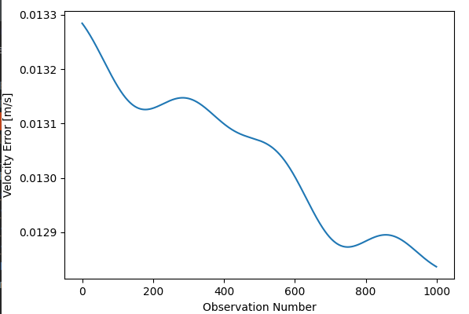

TLE Estimator by GPS Measurements
=================================

Simple batch filter estimation algorithm via SVD to determine the orbit of a satellite by GPS single-point positioning measurements.
Code provides the following features:
* Read GPS receiver telemetry files.
* Batch filter to calculate estimate position and velocity of satellite at initial measurement epoch.
* Convert position and velocity in xyz to Kepler orbital parameters.
* Write and read satellite TLE files based on estimated ephemeris.

## 1. Overview

1. Functions
    - The `BatchEstimator` class manages the GPS measurement and TLE files, estimates position and transforms between TLE.
	
2. Related Files
    - `data\` folder should contain the GPS measurements to be read
    - `kernel\` folder should contain the appropriate SPICE library files. The required files are:
       - [de440.bsp](https://naif.jpl.nasa.gov/pub/naif/generic_kernels/spk/planets/)
       - [earth_assoc_itrf93.tf](https://naif.jpl.nasa.gov/pub/naif/generic_kernels/fk/planets/)
       - [earth_latest_high_prec.bpc](https://naif.jpl.nasa.gov/pub/naif/generic_kernels/pck/)
       - [naif0012.tls](https://naif.jpl.nasa.gov/pub/naif/generic_kernels/lsk/)

3. Dependencies
    - This code is developed and tested on Python3. There is a number of class dependencies:
       - numpy
       - pandas
       - pyatmos
       - spiceypy
       - numdifftools
       - scipy
       - pyshtools
       - sgp4

    - These may be simply installed using: `pip3 install numpy pandas pyatmos spiceypy numdifftools scipy pyshtools sgp4`

4. How to use
    - Make an instance of the `BatchEstimator` class by `batch_estimator = BatchEstimator.BatchEstimator()`.
    - Read a TLE sample of the spacecraft, perhaps from Celestrack or another source, specifying the string using `batch_estimator.read_tle(tle_string)`.
    - Read the GPS data file, specifying filepath, using `batch_estimator.read_gps_data(filepath)`.
    - Estimate the orbit by the GPS data using an SGP4 propagator estimate, `batch_estimator.estimate_batch_orbit_sgp4()`
    - To retrieve the new TLE string, use `tle_string = batch_estimator.write_to_tle()`.
    
    
## 2. Algorithm Details

1. 

## 3. Software Verification

1. Orbit estimate by SGP4 propagated truth
    1. Overview
        - Propagate a sample set of TLE using SGP4. The sample set of TLE is:
          ``1 55072U 23001BR  23040.15743944  .00016529  00000+0  91057-3 0  9998``
          ``2 55072  97.5013 101.7243 0016943  94.7500 265.5667 15.13962877  5687``
        - Satellite measurements are taken every 10 s for 1000 samples, with a noise of 10 m in each GPS receiver measurement.
        - Introduce measurements to the `BatchEstimator` as a supposed GPS measurement dataset.
        - Estimate the batch orbit by SGP4.
        - Compare both the estimated TLE and the error difference.
    
    2. Results
        - The estimated TLE code.
        ``1 55072U 23001BR  23040.15743944  .00016529  00000+0  91057-3 0  9998``
        ``2 55072  97.5013 101.7243 0016943  94.7495 265.5671 15.13962885  5684``
    
        - Calculated position error by the SGP4 sample data to the estimated position by the newly calculated data.
        
        
        - Calculated velocity error by the SGP4 sample data to the estimated position by the newly calculated data.
        
      

## Notes
1. Some improvements are still be made in the code. These include:
    - Fixing fidelity to the standard propagator (non-SGP4), where the atmosphere drag 'expo' and 'jb2008' and and spherical harmonic gravtitational acceleration 'spherical' models are not yet working.
    - Adding optimisation of the atmospheric drag b-star as a parameter in the batch estimator.

2. The function `estimate_batch_orbit_sgp4` performs much better than `estimate_batch_orbit` as it the SGP4 model is better developed than using newtonian based propagation. Currently, the `estimate_batch_orbit_sgp4` code should be preferenced.

